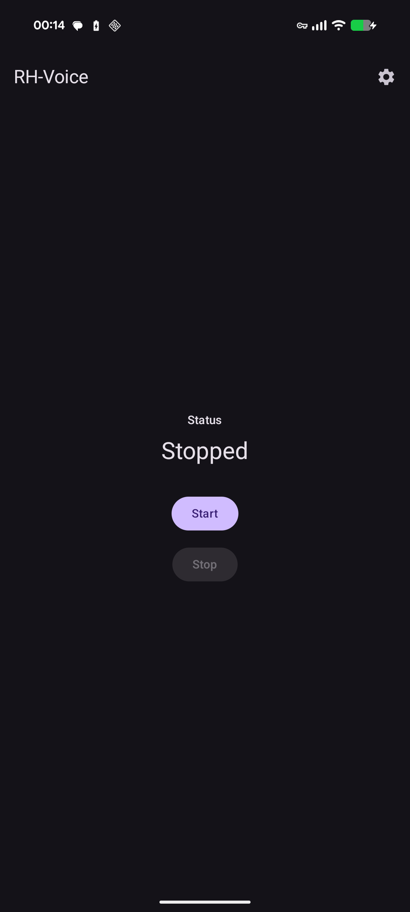
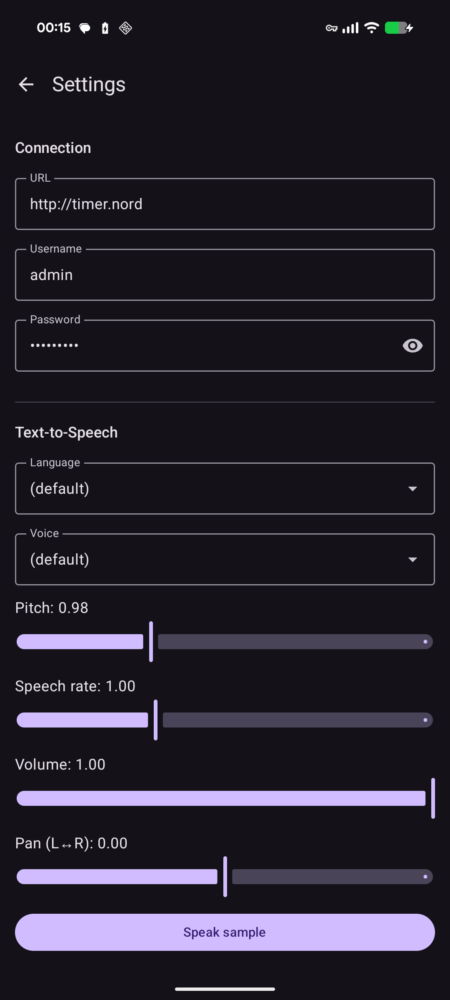

# RH-Voice

An Android companion app for [RotorHazard](https://github.com/RotorHazard/RotorHazard) FPV
race timers. Connect your phone to the timer once, lock the screen, and let RH-Voice
read out lap times and play the same staging / start / end tones the RotorHazard web UI
plays — even while music keeps playing in the background.

Built because the web UI's audio only works while the browser tab is open and the screen
is on. A phone in your pocket should do the same job.

## Features

- **Socket.IO client** for RotorHazard's server protocol (Flask-SocketIO v4).
- **Voice announcements** for every event the web client speaks:
  - Lap passes (`phonetic_data`) → `"<callsign>, Lap <n>, <phonetic time>"`
  - New race leader (`phonetic_leader`) → `"<callsign> is the new leader"`
  - Race-finish / winner / plugin announcements (`phonetic_text`) → spoken verbatim
- **RotorHazard-faithful beep pattern** synthesized locally (no internet roundtrip):
  - 440 Hz triangle staging ticks at one-per-second, count driven by the
    server's `staging_tones` value
  - 880 Hz / 700 ms start tone at T=0
  - 440 Hz final-5-second ticks + 880 Hz end tone at race expiry (for timed races)
- **Foreground service + partial WakeLock** so the connection and announcements keep
  running with the screen off and the phone in your pocket.
- **Audio ducking** via `USAGE_ASSISTANCE_NAVIGATION_GUIDANCE` and `AUDIOFOCUS_GAIN_TRANSIENT_MAY_DUCK`
  — background music is automatically lowered for the duration of each tone or spoken
  phrase, then restored. Music is *not* ducked during the silent ~25 s of a 30 s race;
  focus is only held across each tone cluster.
- **Configurable TTS** — voice, language, pitch, speech rate, volume, pan. All settings
  are persisted in `EncryptedSharedPreferences` and survive reboots.
- **Settings preview** — a *Speak sample* button on the Settings screen so you can
  tune voice / pitch / rate without running a real race.
- **Reconnect on its own** — the Socket.IO client transparently reconnects with
  exponential backoff if the timer's Wi-Fi drops.

## Screenshots

| Main | Settings |
|------|----------|
|  |  |


## Installation

Pre-built APK: download from the [Releases](../../releases) page and install with
"Install from unknown sources" enabled for your installer of choice.

Or build from source:

```bash
git clone https://github.com/<user>/rh-voice.git
cd rh-voice
./gradlew :app:installDebug
```

Requirements: Android 8.0 (API 26) or newer.

## Configuration

1. Tap the **gear icon** on the main screen to open Settings.
2. Under **Connection** enter your RotorHazard server URL — typically
   `http://<timer-ip>:5000` on the same Wi-Fi network as the phone.
   The username / password fields are unused by RotorHazard's Socket.IO
   handshake; leave them blank or fill them in for future use.
3. Under **Text-to-Speech**, pick a language and voice from your phone's installed
   TTS engine, then dial in pitch, speech rate, volume, and pan. Tap **Speak sample**
   to preview. Settings save automatically.
4. Back on the main screen, tap **Start**. A persistent notification confirms the
   foreground service is running.
5. Stage and run races from the RotorHazard web UI as usual. RH-Voice will speak
   each announcement and play each tone in sync (within typical LAN latency,
   ~100 ms).

Tap **Stop** when you're done. The service shuts down, the connection closes, and
the persistent notification goes away.

## How it works

- A single foreground service (`SocketService`) owns the Socket.IO client and a
  `PARTIAL_WAKE_LOCK` so the CPU keeps running with the screen off.
- The service subscribes to `phonetic_data`, `phonetic_text`, `phonetic_leader`,
  `race_status`, and `stage_ready`, and emits `load_data` on connect to ask the
  server for pilot/heat/current-race state.
- Voice output goes through `AnnouncementSpeaker` (the system TTS engine).
- Tones are PCM triangle waves synthesized on the fly and played through a fresh
  `AudioTrack` per beep. Scheduling is a single coroutine seeded by the
  `pi_staging_at_s` / `pi_starts_at_s` / `race_time_sec` fields from `stage_ready`
  — same timing as the RotorHazard web client's local timer, no clock-sync
  protocol needed.
- The foreground service is registered with `foregroundServiceType="dataSync"`
  on Android 10+ (a long-running network connection to the timer is not a
  supported `connectedDevice` use case).

## Limitations

- HTTP traffic only; the app enables `android:usesCleartextTraffic="true"` because
  RotorHazard serves plain HTTP. If you front your timer with HTTPS it'll work
  but the cleartext flag is harmless.
- No per-event toggles yet (the web client lets you choose whether to speak lap
  count vs. lap time vs. callsign; we always speak all three when available).
- Single-timer setups only. `phonetic_split_call` (intermediate-gate split times
  from a cluster setup) is not yet handled.

## AI disclosure

This app was built with heavy use of AI agents — protocol research,
design, and most of the implementation were produced through AI-assisted
iteration with a human in the loop driving requirements and review. Treat the
code accordingly: it builds, it works with a real RotorHazard timer, but it
hasn't been through the kind of long-term human-maintainer review you'd
expect from a hand-written project of equivalent scope.

## License

GPL-3.0. See `LICENSE`.
